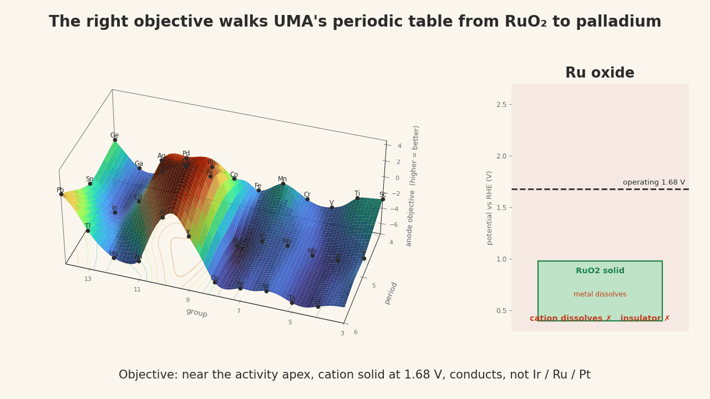

# From RuO₂ to palladium in three steps: the right objective for a non-iridium acid anode

**Interactive version:** open [`host_walk.html`](host_walk.html) in a browser (self-contained, plotly from CDN). Drag to rotate, press play.

## The problem

Green hydrogen by PEM electrolysis needs an anode that evolves oxygen at about 1.7 V in strong acid for tens of thousands of hours.
Only iridium oxide does this well, and iridium is one of the scarcest elements on Earth. Ruthenium oxide is more active but
dissolves in hours. Fifteen years of work have gone into doping RuO₂ (Ta, W, Nb, Cr, Mn, F) to slow that dissolution and into
screening earth-abundant oxides (Mn, Co, Sb frameworks) that mostly die within days. The community's stated open problem is that
activity has a descriptor (the OER volcano) and stability does not.

## What Lila Sciences found (Sept 2026)

[arXiv:2609.30133](https://arxiv.org/abs/2609.30133): an autonomous lab sputtered 2,942 oxide films from 26 elements across
53 systems, screened each in 1 M H₂SO₄ at 10 mA cm⁻², and let a Bayesian surrogate plus an LLM strategy-picker choose the
next batch. The exploration-driven strategy reached palladium oxide after about ten material systems. Plain PdOₓ runs at
0.45 V overpotential and keeps 87% of its Pd over 828 h; with 0.09 at% In/Mn it stays under 0.5 V for over 1,000 h.
The additives are trace and sacrificial (In, Mn, Ni are aqueous ions at operating potential); the discovery is the host.
Their released data (`data/lila_oer_exp_data.csv`) shows all five Pd systems within 25 mV of each other in the screen.

Why nobody had it: the field's prior on palladium came from a 2014 dissolution study of Pd *metal*, which corrodes while its
oxide forms. Nobody had started from the oxide. Lila's CSO said his group would have steered a student away; a frontier LLM
never proposed Pd in fifty attempts.

## What this folder does

Starting from ruthenium, the incumbent, walk UMA's element manifold under an objective that states what an acid anode has to be,
and see where it lands. Nothing about palladium is given.

### The objective (four terms over the (group, period) chart, at pH 0.3 and 1.68 V)

1. **Activity**: distance of the covered-surface dG_O − dG_OH at the cus site from the 1.6 eV volcano apex. Computed with UMA on
   a rutile MO₂(110) slab with O* on every cus site (the >1.5 V surface state), every cation carrying the virtual element.
2. **Cation door**: the metal's oxide must remain the stable solid at 1.68 V. This is the redox ladder: Ru(IV) oxidises to
   soluble RuO₄ above 1.0 V, Mn(IV) to MnO₄⁻ above 1.56 V, Ir(IV) to IrO₄²⁻ only above 1.82 V, Pd(IV) has nowhere to go.
   Taken from Materials Project Pourbaix diagrams (`pourbaix_window.py`), interpolated over the chart.
3. **Conductivity**: band gap of that operating oxide (`gaps.py`). Ti, Sn, Ge, Sb, W, Mo oxides pass the cation door but insulate.
4. **The design statement**: a penalty on Ir, Ru, Pt. A non-incumbent anode is the point.

Formally, following Gauthier & Maraschin (JPCC 2026), the dissolution driving force is
`dG_diss(U) = [E(slab − MO₂ unit) + E_bulk(MO₂) − E(O-terminated slab)] + n·e·(U₀ − U)`:
a surface term UMA can compute plus a tabulated bulk redox couple. For Ru versus Ir the surface terms differ by 0.3 eV and the
couple terms by 3 eV. The couple decides. Every lattice-oxygen descriptor the field (and we, a day earlier) used watches only
the first door. That is why our previous walk went to Ta/W and would never have left the early transition metals.

### The walk

Greedy uphill steps of half a group or period. From Ru: Ru → Rh → the Rh/Pd midpoint, three steps. From Ir: two steps to the
same ridge. From Mn: cannot move (no conducting, window-stable oxide nearby, matching the measured MnO₂ window that closes at
1.75 V). The top of the whole landscape is the Rh/Pd ridge.

### Why the surface has this shape

Ruthenium sits in a trough because its terminal oxidation state is VIII. Groups 6 and 7 have soluble oxyanions. Groups 4 and 5
are Pourbaix-stable but insulating. Groups 11 to 13 dissolve as simple ions. The only region where a metal has a stable,
conducting oxide with no higher soluble state is groups 9 and 10 in periods 5 and 6: Rh, Pd, Ir, Pt. Remove the incumbents and
the ridge is Rh and Pd. It is the periodic table's redox chemistry rendered as terrain.

### What is honest about it

The landing is decided by tabulated redox chemistry plus conductivity; the UMA activity and surface terms are nearly flat across
groups 8 to 10 on the unrelaxed surface. The manifold supplies the coordinate system and the smooth walk. Two data bugs surfaced:
Materials Project lists RuO₄ and OsO₄ as solids (excluded by O:M > 2.5), and its GGA gaps call SnO₂ a near-conductor. The first
version of the walk went to germanium until conductivity was made a hard term.

### What is new

Written as "terminal oxidation state equals the operating state, the oxide conducts, not Ir/Ru/Pt", the acid-anode problem is a
one-line filter that reproduces a three-month autonomous campaign in three steps, and it names **rhodium**: rutile RhO₂ is
metallic and stable from 1.06 V upward, and has no modern acid-OER durability study.

A follow-up dopant sweep on Pd(IV)-terminated PdO(101) (29 elements, UMA, in the main research repo) finds that the persistent
stabilisers of a Pd site are Ir, Rh, Ru (+0.2 to +0.3 eV), that high-valence dopants which protect RuO₂ destabilise PdO
(Pd is 2+ in the lattice), and that every aqueous dopant (In, Mn, Ni, Co, Zn) leaves the same defect after leaching: the Pd site
becomes 1.7 eV harder to dissolve and its activity moves 1.0 eV toward the apex. Lila's additives are sacrificial. The
composition that falls out is Pd with a few percent Rh in the surface cation shell.

## What would falsify this

- **Rhodium.** The walk's second peak is a prediction Lila did not make. If sputtered rutile RhO₂ films dissolve or are
  inactive in 1 M H₂SO₄ at 10 mA cm⁻² over hundreds of hours, the ridge is wrong there and the objective is missing a term.
- **Pd + Rh.** The dopant sweep says a few percent Rh in the Pd surface shell should raise retained Pd fraction relative to
  plain PdOₓ without raising overpotential. A side-by-side sputter batch settles it.
- **Leaching additives.** The redox table says In, Mn, Ni leave the lattice under operation. ICP-MS of the electrolyte during
  the first hours of a Lila-type film should show them; if they stay in the lattice, the sacrificial reading is wrong.
- **Ta in PdO.** The sweep says a persistent Ta neighbour makes a Pd site easier to dissolve (−0.8 eV) while present. If
  Ta-only-doped PdOₓ outlasts plain PdOₓ under identical conditions, that number is wrong.

## Files

| file | what |
|---|---|
| `pourbaix_window.py` | Materials Project scan of the stable phase vs potential at pH 0.3 for 32 elements → `data/pbx_window.json` (needs `MP_API_KEY`) |
| `gaps.py` | band gap of each element's operating oxide → `data/gaps.json` |
| `landscape.py` | UMA: covered-surface activity and Born–Haber surface term with all cations virtual, 115 chart points → `data/twodoor_chart.json` (GPU, ~3 min) |
| `objective.py` | assembles the four-term objective, prints the top of the landscape and the walks from Ru, Ir, Mn → `data/twodoor_anim.json` (CPU, seconds) |
| `make_page.py` | builds `host_walk.html` from the objective grid |
| `data/lila_oer_exp_data.csv` | Lila's released 1,125-catalyst screen (CC BY 4.0, from their repo) |

Reproduce without a GPU: `python objective.py && python make_page.py` (uses the cached landscape). With a GPU and a Hugging Face
token for UMA: run `landscape.py` first.

## Open problems

- The activity term is unrelaxed and on an idealised rutile frame; rutile PdO₂ is a metastable proxy for the operando Pd(IV)
  skin on PdO. A Pd(IV)-terminated PdO(101) model exists in the research repo and is the right host for dopant work.
- The cation-door term is data, not UMA. A learned redox ladder (the energy to push MO₂ one oxidation state higher, with an
  aqueous-ion reference) would make the whole objective differentiable over the manifold.
- Kinetics. Everything here is thermodynamic margin. Lifetimes are set by grain boundaries, restructuring (Lila's needle
  nanostructure) and protocol. The map says which compositions have no thermodynamic reason to fail; the lab converts that to hours.
- Rhodium. RhO₂ is the untested prediction. Its Born–Haber surface term and covered activity are one afternoon of compute.
- Pd + Rh. Pair Hessian at the Pd site for Rh with each sacrificial refiner, then DFT anchors on the endpoint, then a sputter batch.

## Sources

Jenewein et al. arXiv:2609.30133 (Lila); Gauthier & Maraschin, J. Phys. Chem. C 130, 3803 (2026); Binninger et al., Sci. Rep.
5, 12167 (2015); Klyukin, Zagalskaya, Alexandrov, JPCC 123, 22151 (2019); Zagalskaya & Alexandrov, JPCL 11, 2695 (2020);
Kasian et al., Angew. Chem. 57, 2488 (2018); Rao et al., EES 10, 2626 (2017); Man et al., ChemCatChem 3, 1159 (2011);
Exner, Acc. Chem. Res. (2024); Cherevko et al., ChemCatChem 6, 2219 (2014); Speck et al., Angew. Chem. 60, 13343 (2021);
Li/Kong/Nakamura, Angew. Chem. 58, 5054 (2019) and Nat. Catal. 7, 252 (2024); Materials Project (Pourbaix, band gaps).
